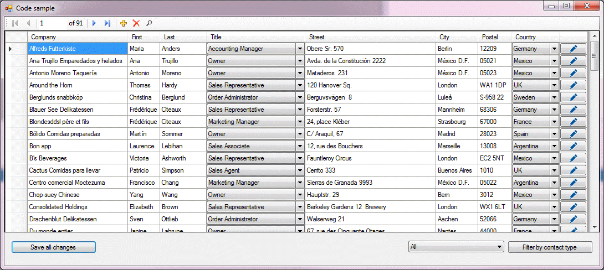

# Entity Framework code first DataGridView

The focus of this repository code is to demonstrate using Entity Framework, code first with an existing database. Most examples will show how to display, edit a single table’s worth of data and in rare cases a master-detail view which usually is done with data wizards. Here the main view is a customer table with three child tables, contact, contact type and country which means the use of joins and the challenge to display, edit, add, delete, sort and filter. Data is presented in a DataGridView with several DataGridViewComboBox columns. The intent is to take away the challenge of dealing with how to save changes of a multi-join data result as in applications rarely are single table presentations.

Code within this repository is a work in progress, all code present has been tested to function before pushed to this repository.

### External libraries
- [Equin.ApplicationFramework.BindingListView](https://github.com/waynebloss/BindingListView) library provides a type-safe, sortable, filterable, data-bindable view of one or more lists of objects. It is the business objects equivalent of using a DataView on a DataTable in ADO.NET. If you have a list of objects to display on a Windows Forms UI (e.g. in a DataGridView) and want to allow your user to sort and filter, then this is the library to use!

### Internal libraries
- NorthWindAzureLibrary which contains the base Entity Framework classes.
- DataValidatorLibrary for use in validating user input against entites in the Entity Framework models. 

### Requires
- Microsoft [Visual Studio](https://visualstudio.microsoft.com/) 2017 or higher
- Microsoft [SQL-Server](https://www.microsoft.com/en-us/sql-server/default.aspx) (Express or Enterprise)
- [SSMS](https://docs.microsoft.com/en-us/sql/ssms/download-sql-server-management-studio-ssms?view=sql-server-2017) (SQL-Server Management Studio) optional

### Article location